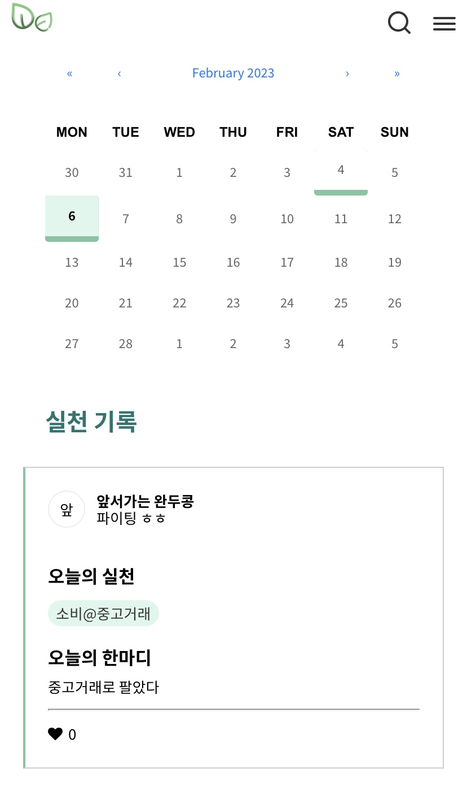

# EcoLog API 개요

## EcoLog 서비스 소개

Eco Log는 하루동안 환경을 위해 실천한 사항을 기록하는 웹앱 서비스입니다. 제로웨이스트를 위해 가벼운 실천을 시도해보고자하는 사용자의 꾸준함을 응원하고 지원하기 위해 기획 및 개발하였습니다.

서비스의 주요 기능은 다음과 같습니다.

* 로그인: 카카오, 네이버, 구글 소셜 로그인
* 프로필: 사용자의 실천 현황을 요약해 제공
* 게시물: 실천 카테고리 또는 직접 입력 실천과 하루 소감을 담은 게시물을 발행하고 수정
* 팔로우: 팔로잉, 팔로워를 조회하고 관리
* 게시물 하트: 팔로우 중인 사용자의 실천 게시물에 좋아요 표시
* 뱃지: 특정 행동을 수행할 때마다 제공되는 뱃지를 조회

## API 퀵 레퍼런스 테이블

| 구분     | 메서드    | 엔드포인트                  | 설명               |
| ------ | ------ | ---------------------- | ---------------- |
| 로그인    | GET    | /api/oauth/kakaotoken  | 카카오 소셜 로그인       |
|        | GET    | /api/oauth/navertoken  | 네이버 소셜 로그인       |
|        | GET    | /api/oauth/googletoken | 구글 소셜 로그인        |
|        | GET    | /api/me                | 현재 로그인 중인 유저 조회  |
|        | DELETE | /api/user              | 유저 탈퇴            |
| 프로필    | GET    | /api/user/profile      | 프로필(실천 현황) 조회    |
|        | POST   | /api/user/profile      | 프로필 수정           |
|        | GET    | /api/user/summary      | 유저 실천 정보 요약 조회   |
|        | GET    | /api/user/search       | 유저 검색            |
| 게시물    | POST   | /api/post              | 게시물 저장           |
|        | PUT    | /api/post/change       | 게시물 수정           |
|        | DELETE | /api/post              | 게시물 삭제           |
|        | GET    | /api/post/daily        | 피드 조회            |
|        | GET    | /api/post/Monthly      | 게시물 월 단위 조회      |
| 실천     | GET    | /api/behavior          | 전체 실천 ID 및 이름 조회 |
| 팔로우    | POST   | /api/user/follow       | 유저 팔로우           |
|        | DELETE | /api/user/follow       | 유저 팔로우 취소        |
|        | GET    | /api/user/follower     | 팔로워 조회           |
|        | GET    | /api/user/following    | 팔로잉 조회           |
|        | DELETE | /api/user/follower     | 팔로워 삭제           |
| 게시물 하트 | POST   | /api/post/heart        | 하트 활성화           |
|        | DELETE | /api/post/heart        | 하트 활성화 취소        |
| 뱃지     | GET    | /api/user/badge        | 유저 뱃지 획득 정보 조회   |

## Base URL

API 호출 시 base URL은 다음과 같습니다.

| 항목       | URL                                  |
| -------- | ------------------------------------ |
| Base URL | `https://www.eco-log-backend.kro.kr` |

## HTTP 상태 코드

| HTTP 상태 코드 | 설명         |
| ---------- | ---------- |
| 200        | 성공         |
| 400        | 잘못된 요청     |
| 401        | 유효하지 않은 토큰 |

## 문서 버전

* 2023.02.09: 문서 첫 생성
