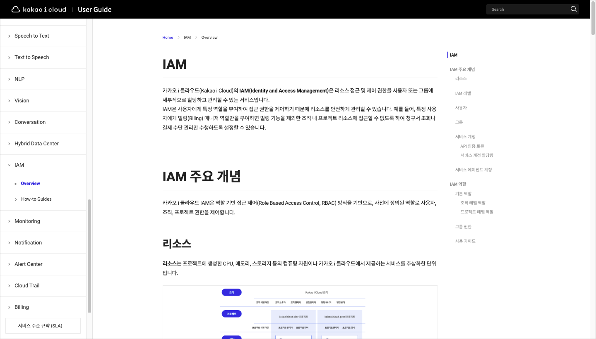
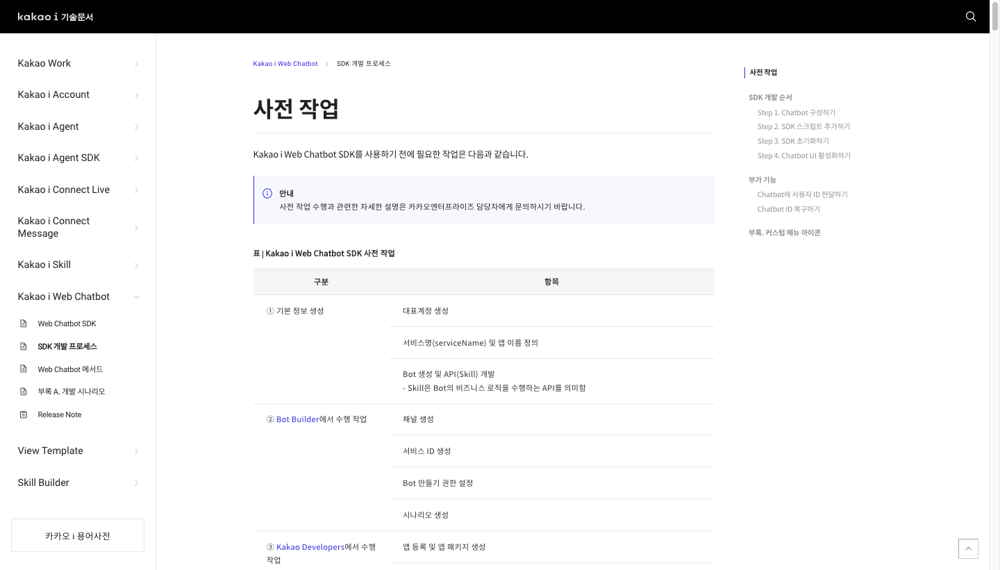
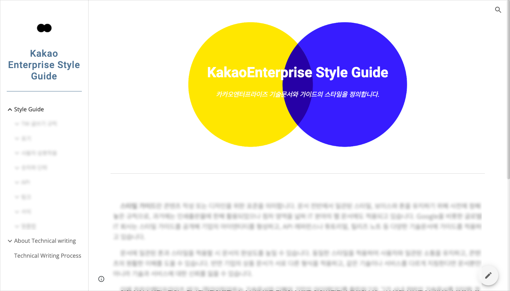
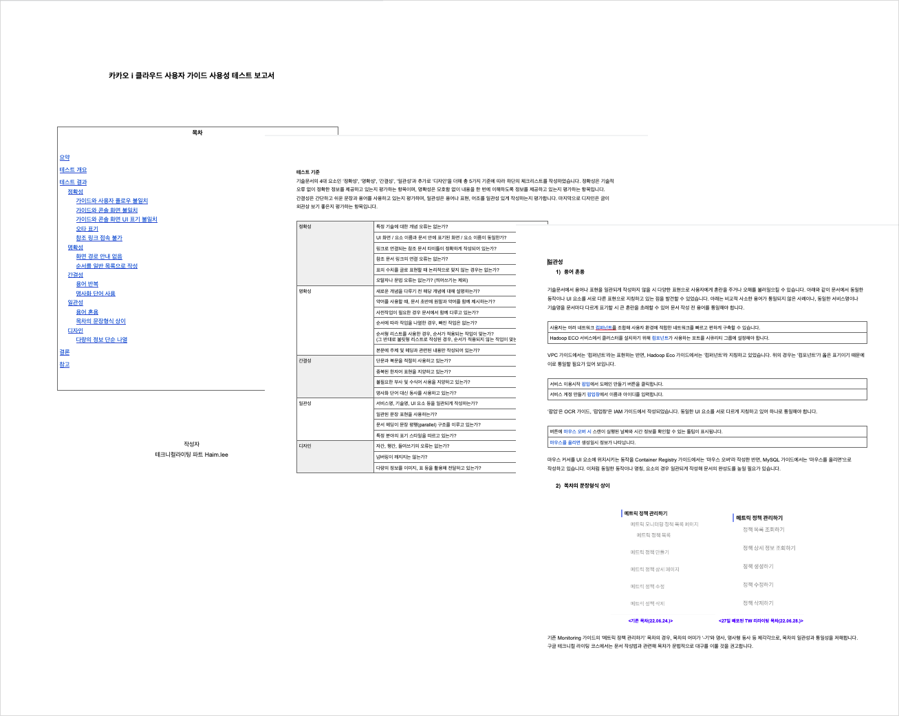

# HAEYOUNG LEE

> INTRODUCE

**문서로 사용자와 소통하고 프로덕트에 기여하는 테크니컬 라이터**  
제 강점은 풍부한 글쓰기 경험을 바탕으로 한 ‘명확한 서면 커뮤니케이션’입니다. 학부 시절부터 다양한 목적과 독자를 대상으로 간결한 문체와 전달력 있는 글쓰기를 실천해왔습니다. 기획서 참고와 리서치로 서비스 이해를 도모하여 기획자, 개발자 등의 문서 초안 작성자와 효율적인 소통을 추구합니다.  
현재 카카오엔터프라이즈 테크니컬라이팅파트 인턴으로서 서비스별 평균 4~5회의 릴리즈 일정에 맞춰 가이드를 배포하고 관리하고 있습니다. 회사 홍보용 AI 기술 책자 원고 20,000자를 리뷰하는 등 다양한 문서 프로세스를 경험했습니다.

> CERTIFICATION

* TOEIC / Total 945 / 2021.01.
* GAIQ / 2022.02.
* AWS Cloud Practitioner / 2023.01.

> EXPERIENCE

* 엔드 유저(End User)/개발자 가이드 편집 및 배포 지원 경험
* 전사 스타일가이드 사이트 기획으로 문서 통일성 확보에 기여한 경험
* 회사 기술 블로그 콘텐츠 리뷰 및 기고(1개) 경험
* 기업 홍보용 AI 기술 책자 “AI Report” 원고 리뷰 경험
* 학내 코딩 커뮤니티에서 ‘서비스의 기술문서를 책임지는 테크니컬 라이터’ 세미나 발표 경험(참여자 50명)

> TOOLS

* 협업: Notion, Slack
* 문서: Markdown, Gitbook, Oopy, Google docs, MS office
* 디자인: Adobe Indesign, Figma
* 프로그래밍: HTML, Python, Github, Jupyter Notebook
* 데이터: Google Analytics

      
	
	

# Project

##  Kakao i Cloud 사용자 가이드 개선 프로젝트

### 프로세스

### 상세 설명

| 툴 | 타겟 독자 | 분야 |
| :--: | :--: | :--: |
| Notion, Markdown, Github | 콘솔 사용자, 개발자 | 클라우드 |

* 기획자 개별 관리하던 문서를 테크니컬라이팅 파트가 전담하여 개선
      - 전체 37개 서비스 중 9개 서비스 문서 품질 개선
* 목차 구조 간소화
* 서비스 스펙 업데이트에 따른 문서 현행화
* 콘솔 테스트로 가이드 내 오류 검토・개선
* 스타일가이드에 따른 스타일 일관성 적용(이미지, UI 표기 등)
* [Kakao i Cloud 사용자 가이드 바로가기](https://console.kakaoi.io/docs/)

## Kakao i Web Chatbot SDK 가이드

### 프로세스

### 상세 설명

| 툴 | 분량 | 타겟 독자 | 분야 |
| :--: | :--: | :--: | :--: |
| Notion, Markdown, Github | 74p(A4 기준) | 콘솔 사용자, 개발자 | 클라우드 |

* 프로덕트 릴리즈 일정에 맞춰 문서 배포 프로세스 수행
      - 22년 7월부터 문서 담당, 배포 7회
* 담당자와의 직접적인 소통, 기획서 참고 등으로 서비스 이해 도모
* 문서 릴리즈 노트 관리
* [Kakao i Web Chatbot SDK 가이드 바로가기](https://docs.kakaoi.ai/kakao_i_web_chatbot_sdk/)

## KakaoEnterprise Style Guide

### 프로세스

### 상세 설명

| 툴 | 타겟 독자 | 기여도 |
| :--: | :--: | :--: |
| Google Site | 전사 구성원 | 60% |

* 글쓰기 퀵 가이드, UI 표기, 이미지 스타일, API 레퍼런스 템플릿 등으로 구성
* 회사 프로덕트 문서의 일관성, 통일성 확보에 기여
* 흩어져있던 내부 스타일 관련 자료를 통합하여 가이드 유지・관리 용이
* 문서 초안의 통일성 확보로 업무 효율성 증가

## Kakao i Cloud 사용자 가이드 사용성 평가 보고서

### 프로세스

### 상세 설명

| 툴 | 분량 | 타겟 독자 | 기여도 |
| :--: | :--: | :--: | :--: |
| Notion, Markdown, Github | 20p(A4 기준) | 콘솔 사용자, 개발자 | 100% |

* Kakao i Cloud 사용자 가이드 개선에 앞서 현재 문서의 문제점을 살펴보고 개선 방향을 논의하기 위한 보고서
* 기술문서 4대 요소(정확성, 명확성, 간결성, 일관성)와 ‘디자인’을 평가 기준으로 체크리스트를 작성 후, 콘솔에서 직접 테스트하며 사용성 저해 사례 발견

## `Side Project` Eco Log API 명세서

### 프로세스

### 상세 설명

| 툴 | 분량 | 타겟 독자 | 분야 |
| :--: | :--: | :--: | :--: |
| Markdown, Gitbook | 35p(A4 기준) | 프론트엔드 개발자 | API |

* 제로웨이스트 실천 기록형 웹앱 서비스로, 서비스 기획 및 테크니컬 라이팅 역할 수행 (구성원: 백엔드 1, 프론트 1, 기획 1)
* 백엔드 개발자가 설계한 API 호출/응답 정보를 프론트 개발자에게 전달하는 API 명세서 편집
* 프론트엔드 개발자의 원활한 문서 탐색을 위해 문서 템플릿과 포맷, 용어 측면에서 개선
* [Eco Log API 명세서 바로가기](https://documenttesting.gitbook.io/ecolog-api-reference/)
